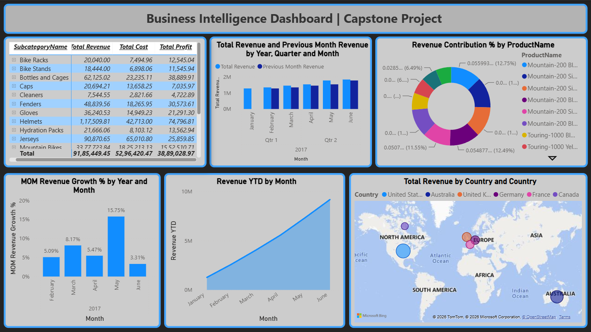

#  Business Intelligence Capstone Dashboard 

An interactive **Power BI Capstone Dashboard** designed to analyze **business performance, KPIs, trends, and operational insights** using business intelligence and data visualization techniques.

##  Project Objective

The goal of this project is to analyze and monitor:

* Business Performance Metrics
* KPI Tracking & Analysis
* Revenue & Profit Trends
* Operational Performance
* Data-Driven Decision Support
* Business Insights & Reporting

This dashboard helps organizations make **strategic decisions** by transforming raw business data into meaningful insights.

##  Key KPIs

* **Business Performance Metrics**
* **Revenue & Profit Analysis**
* **Trend Monitoring**
* **KPI Evaluation**
* **Operational Insights**
* **Performance Tracking**

### Business Questions

* How is overall business performance changing over time?
* Which KPIs contribute most to business growth?
* What trends and patterns can be identified?
* How can performance be improved through insights?
* Which business areas require attention?

##  Project Process

1. **Data Collection** – Imported business datasets into Power BI
2. **Data Cleaning** – Processed and transformed data using Power Query
3. **Data Modeling** – Built relationships between datasets
4. **KPI Creation** – Developed DAX measures for performance analysis
5. **Dashboard Development** – Created interactive reports and visualizations

##  Dashboard Preview

##  Key Insights

* Identified important business trends and KPI patterns
* Improved visibility into performance metrics
* Enabled better monitoring of operational efficiency
* Supported data-driven business decisions

##  Conclusion

This **Business Intelligence Capstone Dashboard** provides a comprehensive overview of business performance through **interactive visualizations, KPI tracking, and analytical insights**, enabling smarter and more effective decision-making using **Power BI**.
