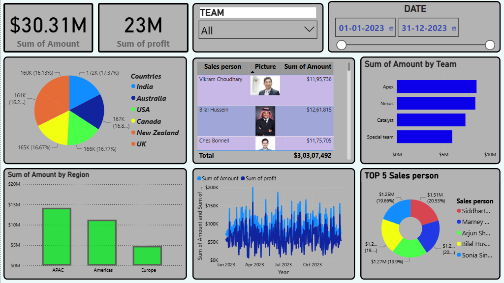
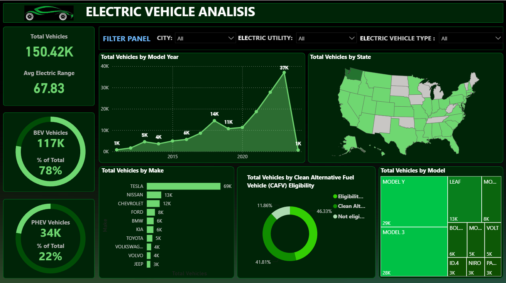
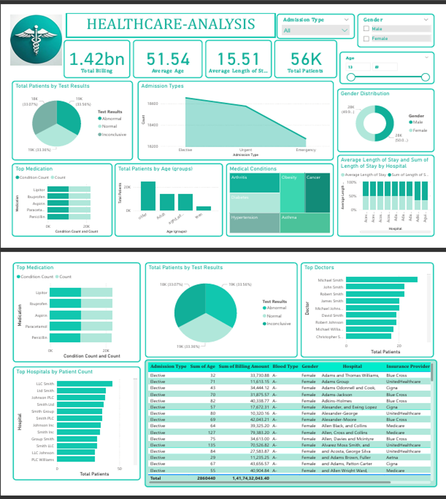
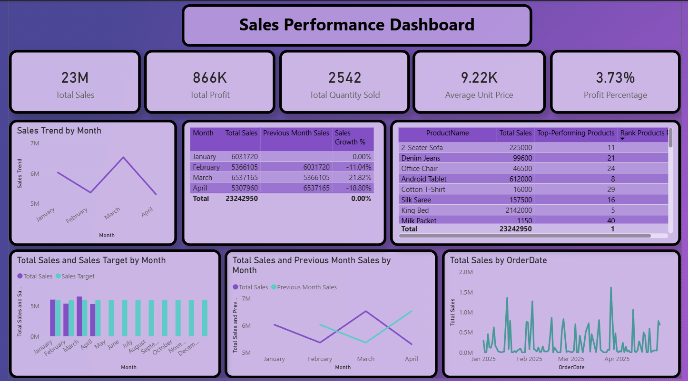

# 📊 Power-BI Journey

A collection of **Power BI projects, dashboards, and business intelligence case studies** showcasing my learning journey in **data analytics, visualization, and dashboard development**.

## 🚀 Projects

### 1. Business Intelligence Dashboard | Capstone Project

An interactive **Business Intelligence Capstone Dashboard** built to analyze **business performance, KPIs, trends, and operational insights** using Power BI and data visualization techniques.

📁 Folder: `Business-Intelligence-Capstone-Dashboard`

---

### 2. Business Performance Dashboard

An interactive **Business Performance Dashboard** built to analyze **business metrics, revenue trends, operational performance, and key business insights** using Power BI.

📁 Folder: `Business-Performance-Dashboard`

---

### 3. EV Vehicle Analysis Dashboard

An interactive **EV Vehicle Analysis Dashboard** built to analyze **electric vehicle adoption, manufacturer performance, market trends, and EV growth insights** using Power BI and data visualization techniques.

📁 Folder: `EV-Vehicle-Analysis-Dashboard`

---

### 4. Healthcare Analysis Dashboard

An interactive **Healthcare Analysis Dashboard** built to analyze **patient demographics, treatment trends, hospital performance, and healthcare KPIs** using Power BI and data visualization techniques.

📁 Folder: `Healthcare-Analysis-Dashboard`

---

### 5. Sales Performance Dashboard

An interactive Power BI dashboard for analyzing **sales, profit, product performance, monthly trends, and target achievement**.

📁 Folder: `Sales-Performance-Dashboard`

## 🛠️ Skills Used

* Power BI
* Power Query
* DAX
* Data Cleaning
* Data Modeling
* Data Visualization
* Business Intelligence
* KPI Analysis
* Dashboard Development

More projects will be added as I continue my **Power BI learning journey**.
